# 모의밴픽

## 요구사항

- 피어리스 고려
- 진짜 롤 대회 밴픽하는거 같애야 함
- 라이엇 API 쓸 수 있나??
- 쉽게 공유하고 해야 댐
- 사용성 좋아야 함
- 모바일 반응형
- 광고 수익
- 다국어 지원 - 영어, 중국어
- RAG? 밴픽 데이터 넣고.. 가상의 팀 상대로 밴픽할 수 있는 기능..

## 디자인 레퍼런스

### 롤 모의 밴픽 시뮬레이터 https://www.banpick.kr

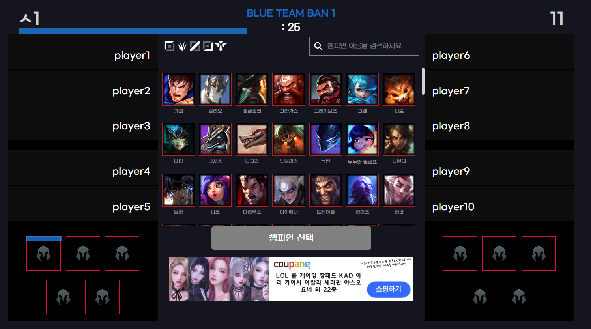

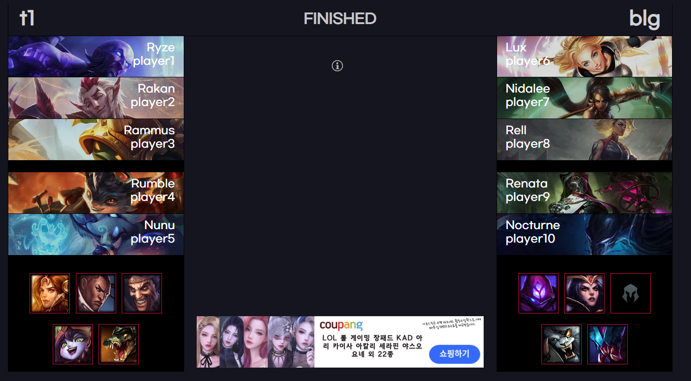

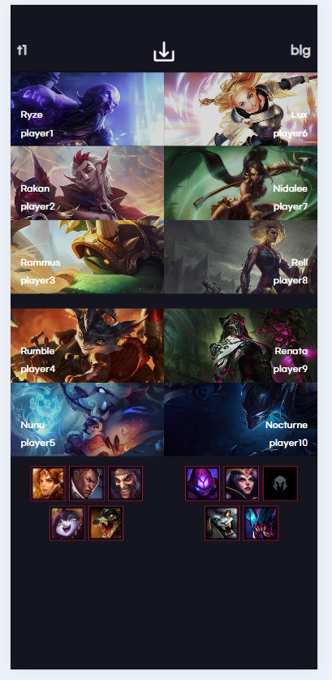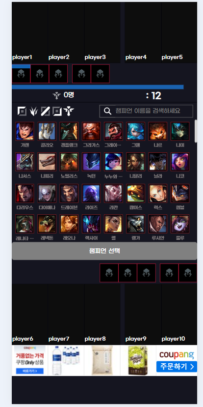

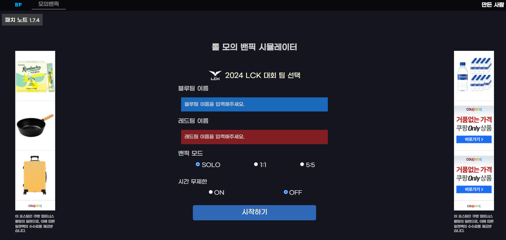

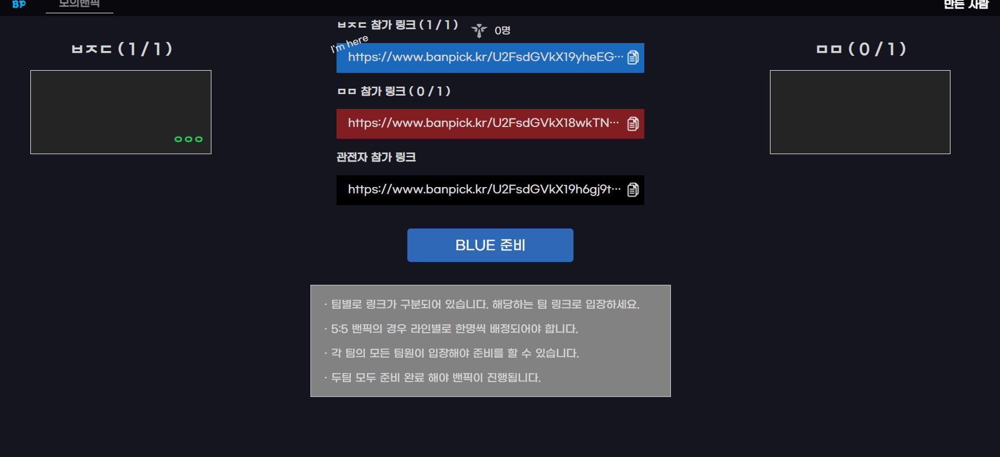

### LOLPS 모의밴픽

BGM 있음, 반응형 ㄴㄴ

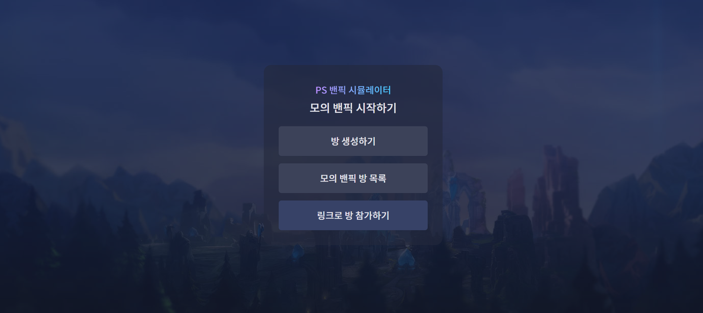

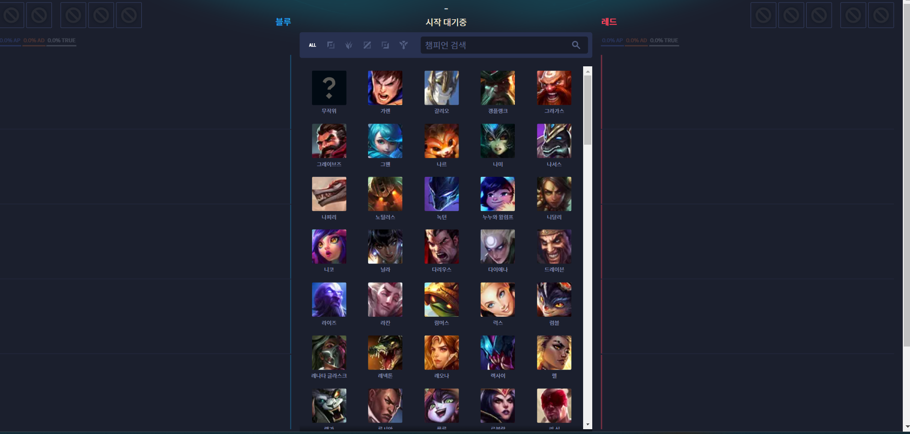

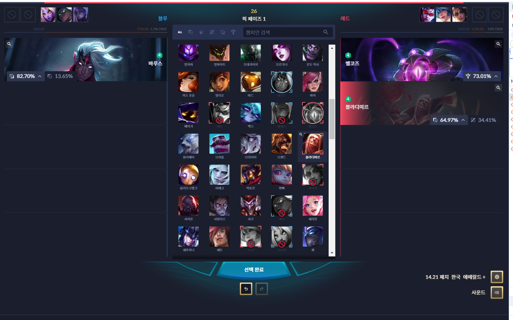

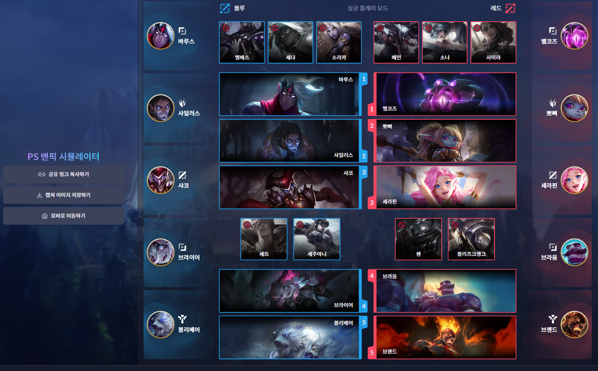

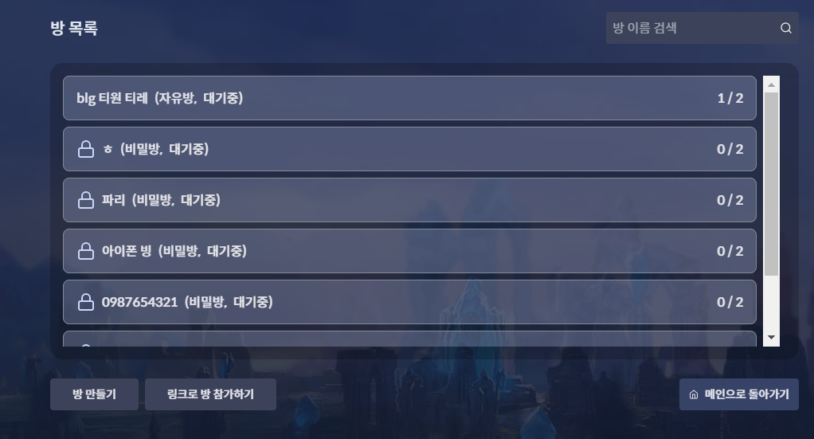

### 24 롤드컵 공식

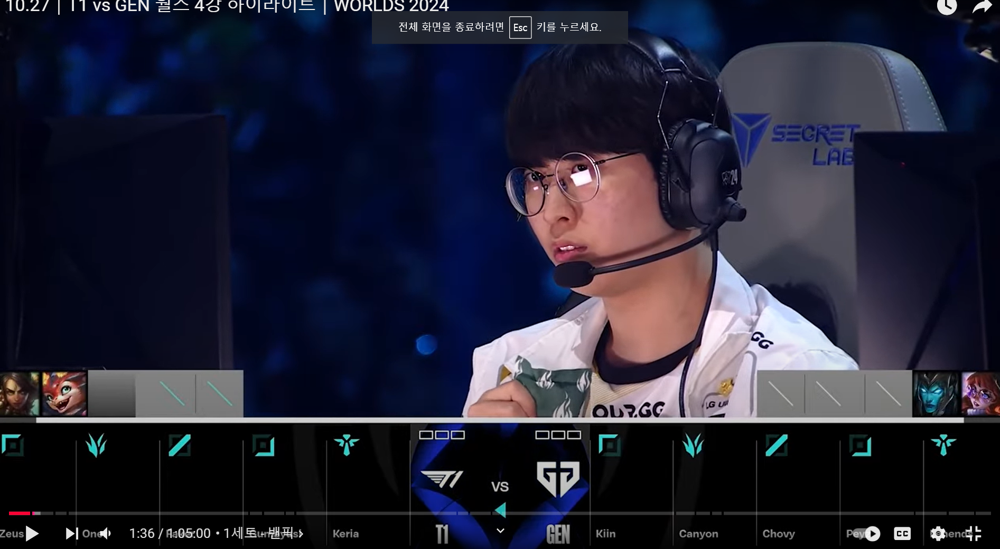

### 롤

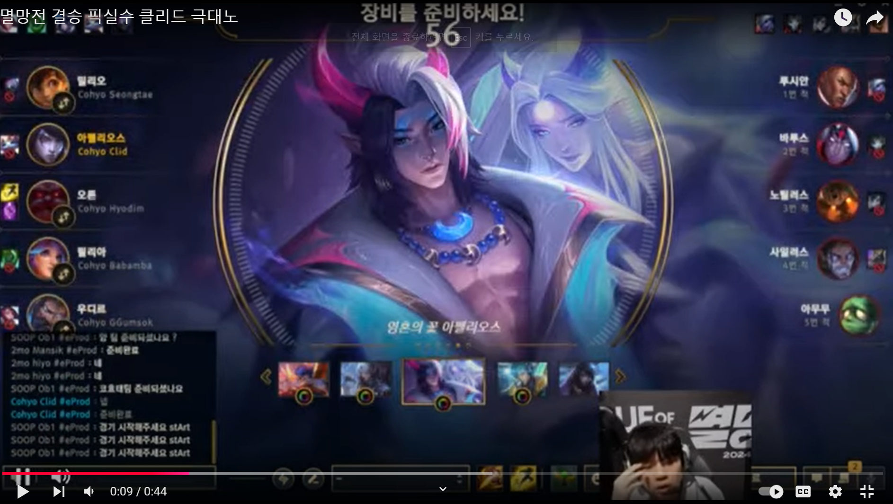

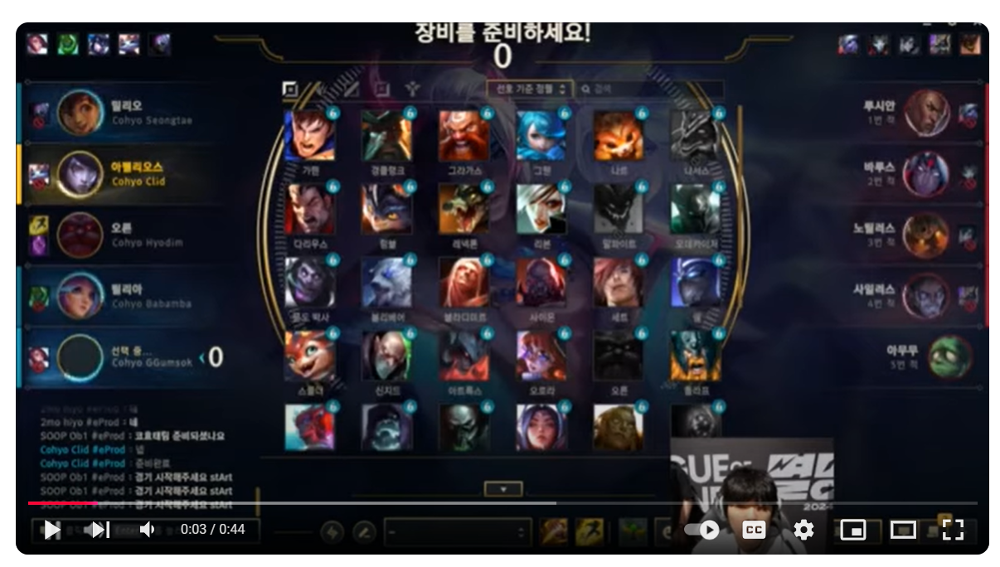

## 개발 고려

- webRTC로 1대1 구현이 가능한가? 서버 개발이 필요할지...
- TDD, 정적 사이트로 nginx 서빙
- 분석툴 도입 - GA 또는 딴 거
- 이슈 트래커 - Centry or Help Scout
- vite, vitest로 ㄱㄱ
- 광고 - Google Publisher Tag | Aniview Ad Server | 33Across
- 보안 - ?
- SEO 랭킹 1등 먹어야 함
- 테스트, 배포 자동화..

