# 모의밴픽

## 요구사항

- 무중단 배포 해야댐
- 서버 개발자 필요? 전적 저장, 채팅서버 구현.. webRTC는 signalling Server 있어야 하긴 함
- 피어리스 + 기존 밴픽 방식 지원
- 진짜 롤 대회 밴픽하는거 같애야 함
- 라이엇 API 쓸 수 있나??
- 쉽게 공유하고 해야 댐
- 사용성 좋아야 함
- 모바일 반응형
- 광고 수익
- 다국어 지원 - 영어, 중국어
- 끝나고 승률 보여주기
- 방 만들어서 겜하고 전적도 저장? https://drafter.gg/

## 디자인 레퍼런스

### 롤 모의 밴픽 시뮬레이터 https://www.banpick.kr

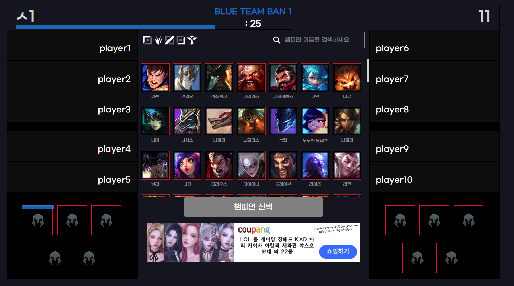

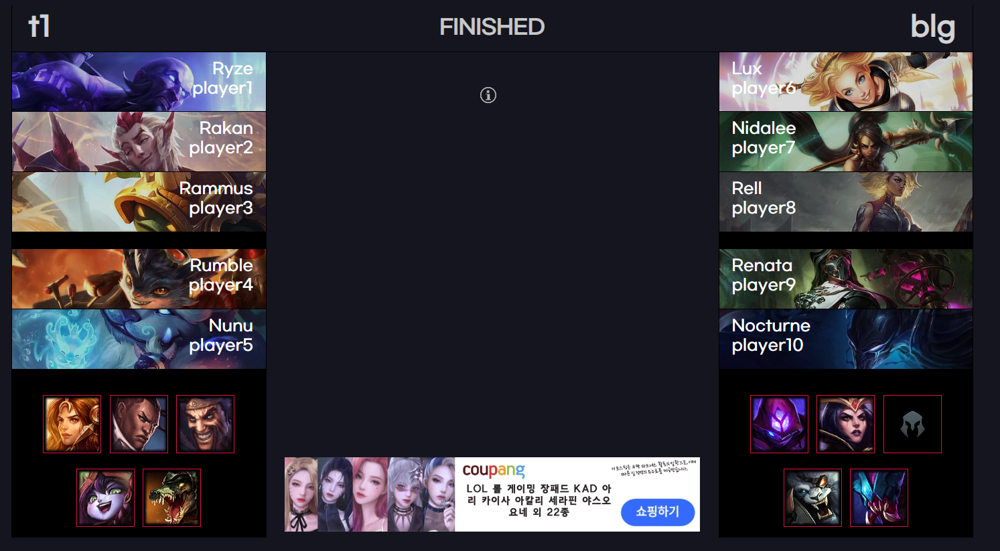

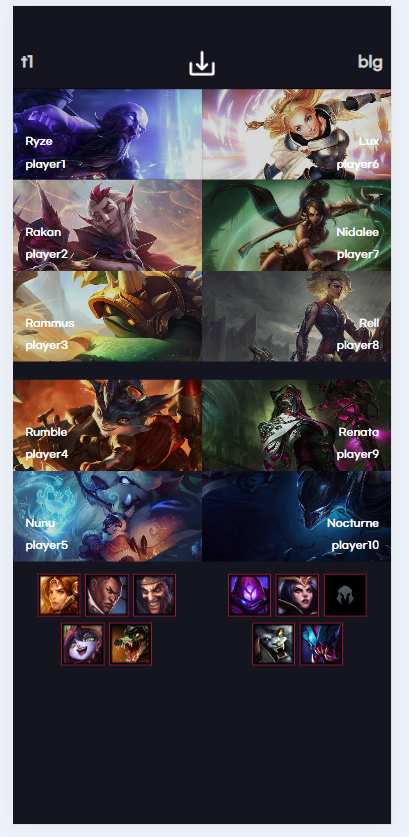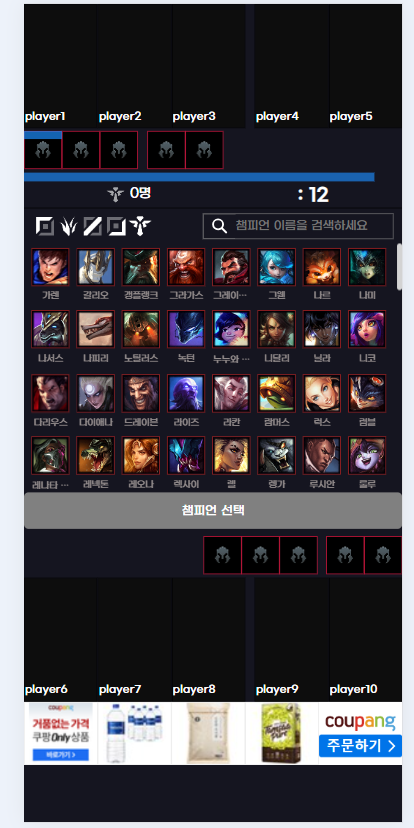

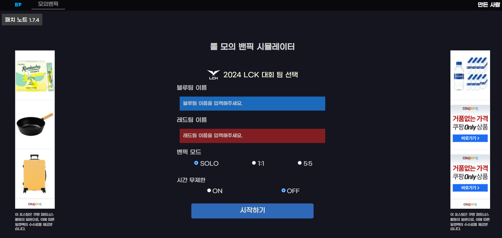

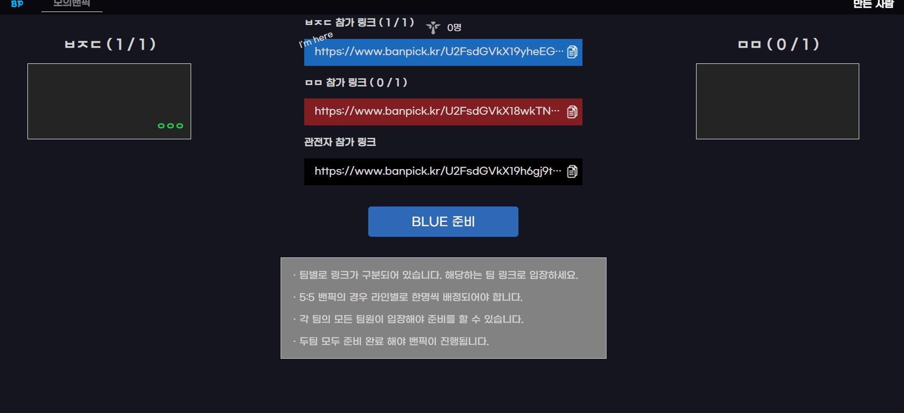

### LOLPS 모의밴픽

BGM 있음, 반응형 ㄴㄴ

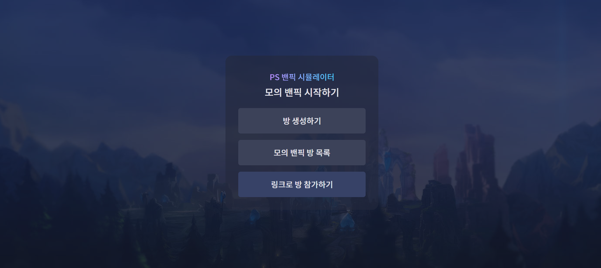

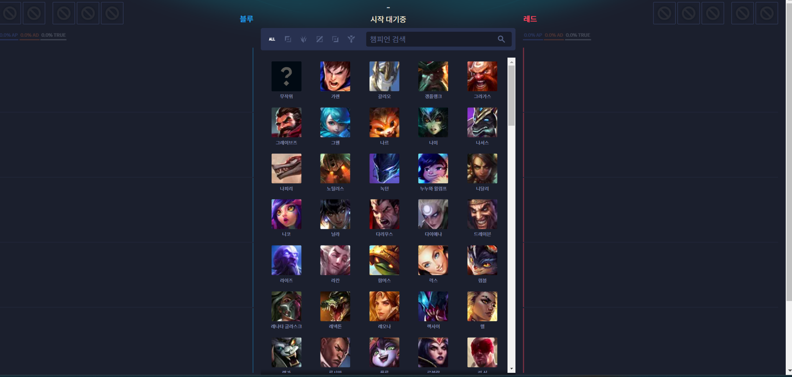

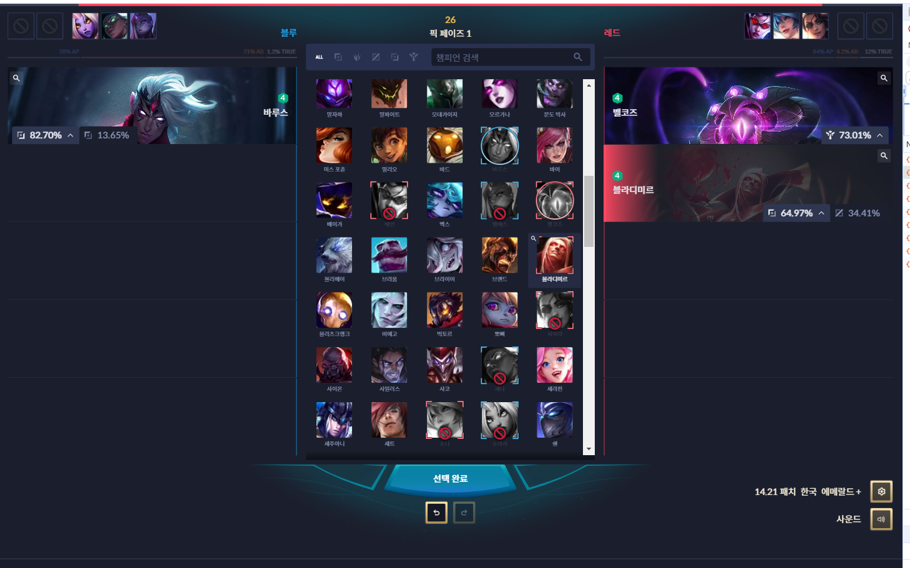

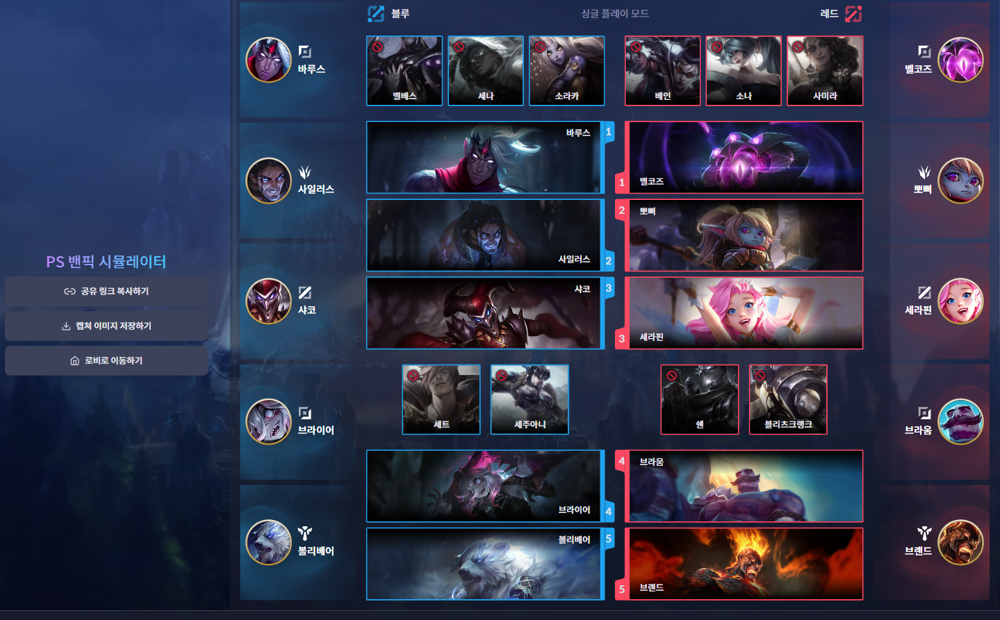

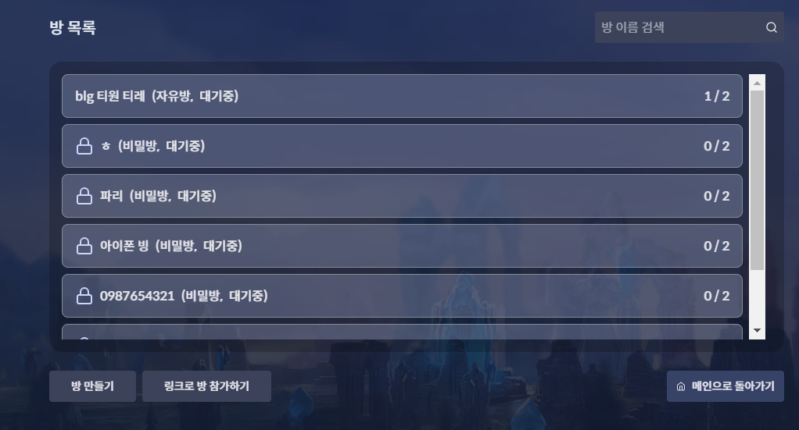

### 24 롤드컵 공식

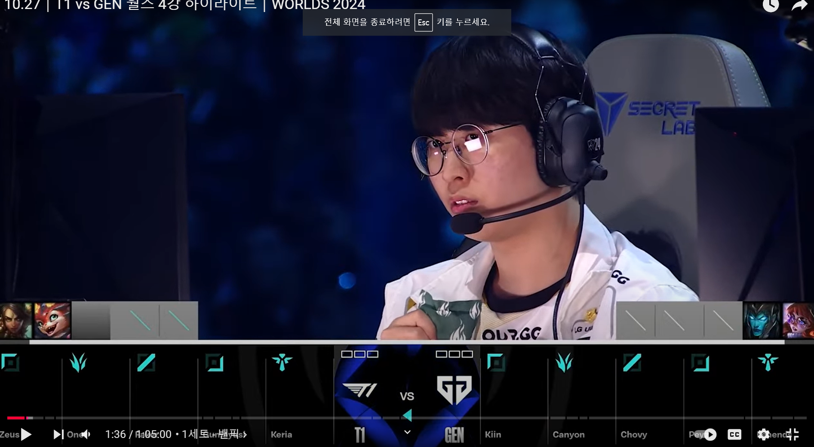

### 롤

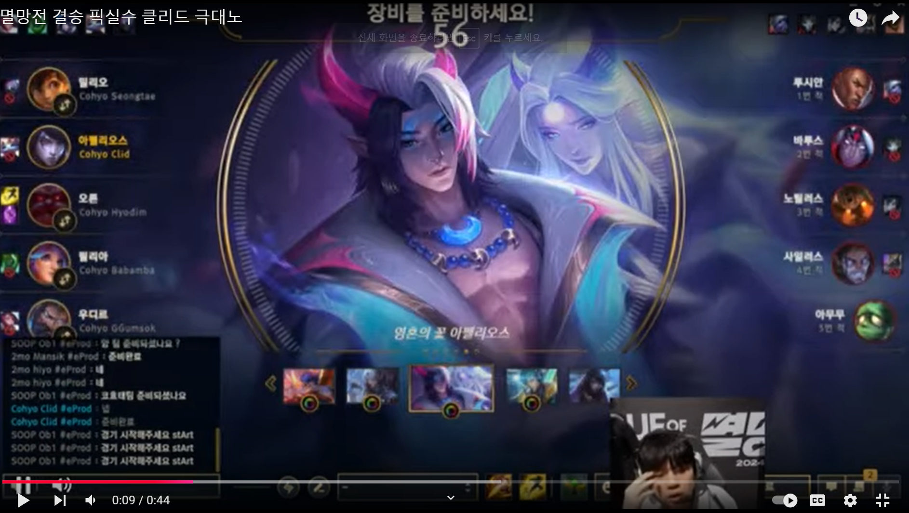

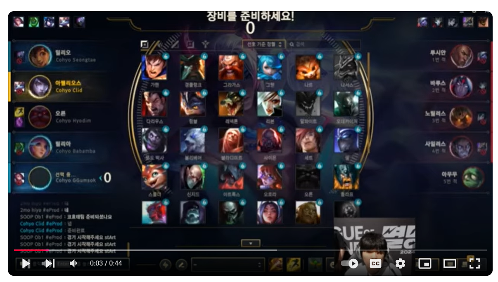

### draftgap.com
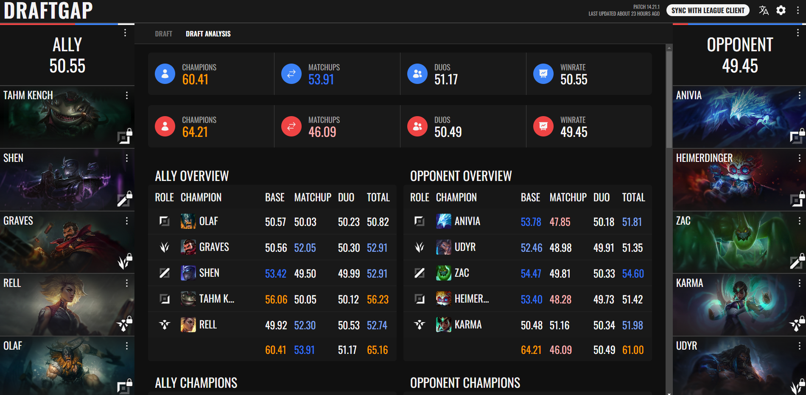

## 개발 고려

- webRTC로 1대1 구현이 가능한가? 서버 개발이 필요할지...
- TDD, 정적 사이트로 nginx 서빙 or 
- 분석툴 도입 - GA 또는 딴 거
- 이슈 트래커 - Centry or Help Scout
- vite, vitest로 ㄱㄱ
- 광고 - Google Publisher Tag | Aniview Ad Server | 33Across
- 보안 - ?
- SEO 랭킹 1등 먹어야 함
- 테스트, 배포 자동화..
- Framer motion 으로 게임같은 모션

## TODO
1) 기본 구조 잡기: FSD + react router
- 페이지 2개 : 홈, 밴픽 페이지
- 1대1 대결은 일단 고려X 혼자서 할 수 있는 사이트를 먼저 만든다
2) husky로 lint + 커밋 메시지 규칙 설정
3) 코드 래빗 적용: 코드 리뷰를 해야대
4) CI+CD : Vercel 무료로 일단 올리자 (배포 전 테스트 코드 작동 돌아야 함)
---- 위에서 공통으로 쓸 수 있는 부분만 빼서 boilerplate 하나 올려 놓기